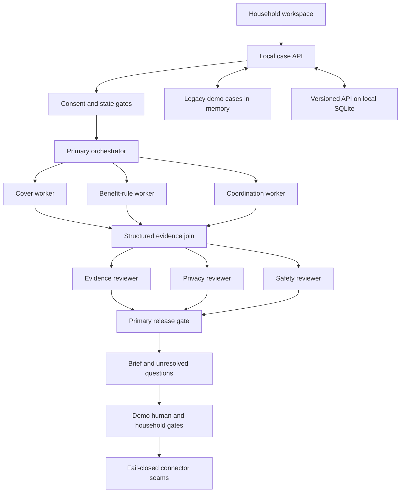

# Knowvia MVP

Local, synthetic prototype of household health-insurance understanding, buying and continuity.
Not an insurance adviser, staffed support service or claims platform.

**Product North Star:** no household should reach an insurance decision or hospital admission without
knowing what cover it has, what remains uncertain, what money it may need and what it should do next.

**Product boundary:** Knowvia is the agent. The Household Health Treasury, group and personal policy
modules, proposal and underwriting record, correspondence history, Admission Readiness Brief and Claim
Position Brief are capabilities inside it. This prototype does not yet operate any of them with real data.

## Brand implementation

The prototype uses the brand tokens and product typography defined in
[research/01-product.md](research/01-product.md#brand-system). The public brand is **Knowvia**.
Its tagline is **Know your cover. Before you need it.** Coversaath was the internal codename and is
retired from all new copy. It survives only in existing filenames, the database path, the session cookie,
the git remote URL and the research transcripts, which are real artefacts left as they are. The interface signature is
`Known / Unknown / Next`: evidence stays visible, uncertainty stays explicit and each open issue gets a next action.

**LinkedIn overview:** Knowvia helps people understand their health insurance before they need to use it.
Most policies are bought with good intent and opened only when someone is admitted to a hospital. By then,
people are trying to understand what is covered, which hospital to visit, what documents matter, and what to do
if a claim gets stuck. Knowvia turns policy documents into a clearer view of what you know, what still needs
checking, and what to do next. We do not replace insurers or promise claim approvals. We help you ask better
questions earlier.

## Specialist coverage agents

The deterministic case flow now calls three bounded product agents before classification:

```text
Scoped consent
  ├─ Profile and manual document intake agent
  ├─ Group health cover agent
  └─ Personal health cover agent
              ↓
   source-linked coverage graph
              ↓
 deterministic routing classification
              ↓
 evidence, privacy and safety gates
```

The profile agent minimises fields and separates optional affordability data. The group agent uses
Policy Protection, Policy Constraints, Institutional Intelligence and User Relevance. Institutional
Intelligence is limited to cited routes and case status. It does not rate insurers or predict approval.
The personal agent uses Protection, Constraints, Economics and Suitability. Suitability means evidence
gaps and questions, not a regulated product recommendation.

The classifier returns a route and named uncertainty dimensions. It deliberately returns no risk score
and no probability of claim approval. The structured graph preserves `UNKNOWN` as different from `false`.

HRMS connectivity is on hold. The planned intake path is a direct document upload by the user. Raw
document upload and real OCR are not enabled yet, so the current agents still operate on structured
synthetic evidence.

## Local backend and database

The repository now has a local SQLite schema, migration runner, repositories and backend service layer.
The versioned backend defaults to `.local/coversaath.sqlite` and honours `DATABASE_PATH`. Its first
request opens the database, applies the versioned SQL migration and checks for missing tables,
foreign-key failures and basic integrity. The schema covers households, adult roles, scoped consent,
cases, documents, OCR jobs, evidence, workflow tasks, reviews, approvals, integration outbox records,
webhooks, retention and audit events.

This is a backend foundation, not production data readiness. The `/api/v1` household, consent, case,
transition, analysis-job and audit routes use SQLite and persist across restart. The existing browser
demo still uses the legacy memory-only `/api` case routes, while orchestration snapshots remain under
`.local/runs`. Raw files are not stored, encrypted or uploaded through the API yet. Do not put real
policy or medical documents into this build.

| Path | Responsibility |
|---|---|
| `src/backend/database/migrations/001_initial_schema.sql` | Complete first local schema |
| `src/backend/database/database.js` | SQLite opening, migrations and schema validation |
| `src/backend/repositories/` | Household, consent, case, workflow and append-only audit persistence |
| `src/backend/services/backend-services.js` | Service composition and consent gate |
| `src/backend/state/case-state-machine.js` | Deterministic case transitions and emergency route |
| `src/integrations/` | Fail-closed Sarvam, Gnani, Pine Labs and email boundaries |
| `src/shared/http/` | Canonical framework-free HTTP errors, request parsing and local security helpers |

The database uses Node's current `node:sqlite` implementation. Node may print an experimental warning.
That does not mean the data layer is production-hardened. Encryption, authenticated adult identity,
tenant isolation, backups, retention execution and a durable worker still need implementation.

## Orchestration build

The backend now has a fixed execution DAG, separate model roles, a local persisted event ledger,
parallel stages, independent reviews, cancellation and explicit retry/resume. The old deterministic
case demo remains separate. It is not evidence that live models or insurer integrations were tested.

```text
Consent + immutable synthetic source packet + budget reservation
              ├─ cover worker ──────────┐
              ├─ rules worker ──────────┤ parallel
              └─ coordination worker ──┘
                        source gate
              ├─ evidence reviewer ────┐
              └─ safety reviewer ──────┘ parallel, separate packets
                     primary synthesis
                        release gate
                 result / flag / block
                       human handoff
```

Live mode runs six separate bounded model invocations. The primary dispatcher and release controls
are deterministic. The MVP roles have no external action tools. Fixture mode is explicit, zero-cost,
coded output. Missing model configuration never silently falls back to fixtures.

### Connect Gemini

Create an ignored `.env.local` using [.env.example](.env.example). Set `GEMINI_API_KEY`, retain
`LLM_PROVIDER=google`, and confirm the chosen `LLM_MODEL` and price settings for your account.
The example model/rates were checked against [Google's pricing](https://ai.google.dev/gemini-api/docs/pricing)
on 15 September 2026. A model preference is not proof of insurance-task reliability.
No key should be pasted in chat or placed in `VITE_` variables.

Restart `npm run dev` after editing the server environment. Create a synthetic case in the existing
demo. Give the separate model-sharing permission, then select **Run live agents**. The execution panel
shows each task, attempts, events and reviews. Live provider calls have not been exercised without a key.

For a key-free backend check while the API is running:

```sh
npm run orchestrate -- --fixture
```

For a live synthetic run with configured credentials:

```sh
npm run orchestrate
```

The live command explicitly permits sending its generated synthetic packet to the configured provider.
It does not send real records. No institutional email or payment is authorised by this command.

### Handoff and safety

Call demo human records an attempt, then offers the server-configured number as a phone link.
Clicking that link requests your device's dialler. No call connection, answer, callback or telephony
transfer can be verified. No case context is sent by this flow. The contact is not emergency services
or a claim to licensed advice.

Warnings stay visible. Material issues block release. Citation IDs alone are insufficient; coverage
observations must match the literal synthetic source. Primary free-form summaries are retained for
inspection, but the released summary is deterministic. Questions and unknowns cannot invent amounts.
Neither a reviewer nor the demo human can override insurer authority.

### Implementation map and limits

| Path | Responsibility |
|---|---|
| `src/orchestration/` | DAG, task states, parallel dispatch, gates, budget reservations and local storage |
| `src/models/` | AI SDK agents, Gemini/OpenAI providers, structured schema, fixture executor |
| `src/server/server.js` | Thin server entry point for the legacy demo and persistent versioned API |
| `src/server/routes/v1-backend-routes.js` | SQLite-backed household, consent, case, workflow and audit routes |
| `src/backend/` | Local SQLite schema, repositories, services and deterministic state rules |
| `src/integrations/` | Provider-specific fail-closed boundaries; no verified provider calls |
| `scripts/orchestration-demo.mjs` | Execution monitor without frontend or private model reasoning |

Local run snapshots are retained under ignored `.local/runs`. Atomic file replacement protects
acknowledged snapshots against partial writes; this is not an encrypted database or multi-process job
queue. Process interruption becomes an explicit interrupted state. Engine-level resume preserves completed
tasks; browser sessions, cases and run ownership are still in memory, so API recovery after a server
restart is not yet implemented. A retry may repeat a billed request. Do not use real personal records.

Reservations are conservative, not verified billing, and are not refunded for uncertain attempts.
The default run cap is $0.25 and project reservation cap is $5. The total build ceiling for this work is
₹1,500. Fixture mode has used ₹0 and no provider key or paid rail was called. The USD reservation is a
second, lower provider guard, not an exchange-rate conversion or permission to spend the remaining budget.
Verify current provider rates and billing conversion before any live run.

## Run

Requires Node 22.12 or later.

```sh
npm install
npm run db:init
npm run dev
```

Open http://127.0.0.1:5173. The local API runs on port 8787.

```sh
npm test
npm run build
```

The build produces frontend assets only. It does not deploy the API or configure hosting.

## Implemented

- Single-adult consent-gated renewal, planned-care and emergency demo cases.
- Primary orchestration, parallel deterministic workers and independent rule-based reviewers.
- Sample policy conditions with synthetic source-page/version references and unresolved applicability.
- Admission brief, conservative cash scenario and operator/drill unknowns.
- Clarification drafts, per-question approval and simulated reply history.
- Retain/defer/buy simulation with commission disclosure and household approval.
- Idempotent local payment simulation, never policy issuance.
- Consent revocation and browser-session case isolation.
- Versioned SQLite schema with tested household, consent, case, workflow and audit repositories.
- Separate Sarvam OCR, Gnani voice, Pine Labs payment and email boundaries that fail closed.

No PDFs are parsed. Manual document upload and real Sarvam OCR are not enabled. Pages refer to synthetic
fixture excerpts, not issued policy PDFs. HRMS is on hold and is not an active connector. The original
case workflow makes no emails, calls or payment requests. The separate live
orchestration route can make model requests only with configuration and explicit model permission.
Do not enter real personal records.

## Architecture

The full target and MVP boundary are in [research/03-architecture.md](research/03-architecture.md).



| Path | Responsibility |
|---|---|
| `src/agents/` | Profile, group-cover and personal-cover agents, coverage graph and deterministic classification |
| `src/core/engine.js` | Case transitions, workers, reviews and fixtures |
| `src/server/server.js` | Thin executable entry point and public server export |
| `src/server/create-server.js` | Server composition plus the temporary legacy demo controller |
| `src/shared/http/` | Shared HTTP contracts; `src/server/http/` is a deprecated compatibility path |
| `src/adapters/index.js` | Compatibility facade for model and provider seams |
| `src/integrations/` | Public provider contract, provider-owned folders and shared fail-closed boundary |
| `src/backend/` | SQLite migration, repositories, services and case state machine |
| `src/ui/` | Household workspace and agent trail |
| `tests/` | Core safety and API integration checks |

Supporting material is kept out of the repository root. Visual architecture files are in
`docs/assets/`, raw working evidence is in `docs/evidence/`, and communication drafts are in
`docs/comms/`. The active product pack remains in `research/01-06` and `answers.md`.
The current full working board is [coversaath-exhaustive-working-board.svg](docs/assets/coversaath-exhaustive-working-board.svg).

## Data and security limits

Legacy demo cases live in server memory. Restart clears them. Sessions expire after one hour. The
versioned `/api/v1` routes persist household, consent, case, workflow and audit records in SQLite across
restart. The browser UI still calls the legacy routes, so its visible cases do not survive restart.
The API binds to loopback, checks Host/Origin and uses HttpOnly SameSite cookies.
These are demo controls, not authenticated adult identity or multi-adult scoped consent.
Revocation clears this case's local fields. Production downstream deletion is not implemented.

Before real data: per-adult authentication and permissions, private encrypted document storage,
tenant isolation, persistence, durable jobs, retention/deletion, evaluations and qualified legal/licensed-partner review.

## Integration order

1. Encrypted manual document upload, durable OCR jobs and Sarvam extraction with page-level provenance.
2. Bounded model extraction from OCR output, schema validation and evaluations.
3. Gnani transcription and approved read-back. Telephony/WhatsApp and human transfer need separate verification.
4. Approved institutional email with exact recipient/content approval and reply provenance.
5. Licensed-partner and merchant-approved Pine Labs sandbox checkout, signed webhooks, reconciliation and separate issuance tracking.

Use server-only settings. Never put keys in frontend variables or chat.
The server loads `.env.local` at startup. Available placeholders are `SARVAM_API_KEY`,
`GNANI_API_KEY_ID`, `PINE_LABS_CLIENT_ID`, `PINE_LABS_CLIENT_SECRET`, `EMAIL_API_KEY` and
`EMAIL_FROM`. Keys alone do not enable any provider call. The code reports configured credentials as
`configured_not_verified` and still refuses the action because provider endpoints, request contracts,
webhook verification and account capabilities have not been confirmed. Missing configuration reports
`not_configured`. Both states make no network request.

HRMS has no active key or connector. Users will upload documents manually when the secure upload path
exists. No Delhivery workflow is added without a physical-document need.

## Next gate

Run synthetic buying and planned-care cases first. Before testing real records, complete the data and
operating safeguards. The build ceiling remains ₹1,500. Current fixture and provider spend is ₹0. No
Sarvam, Gnani, Pine Labs or email request was made. Keep refusals, failed drills, conflicts and
no-purchase outcomes visible.
