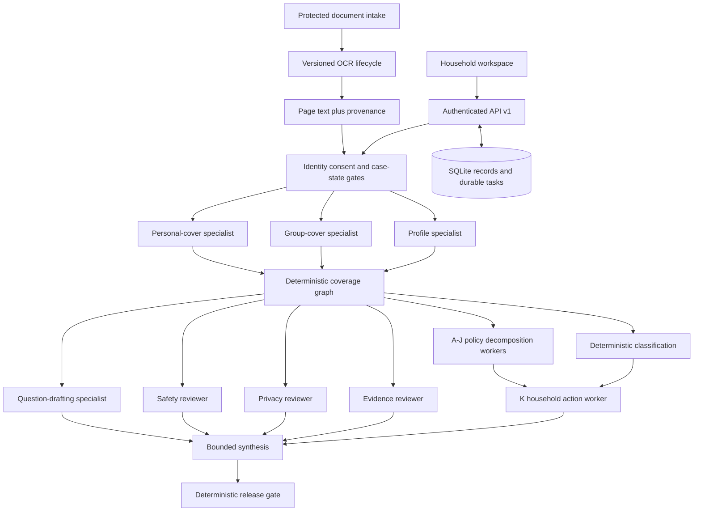

# Knowvia MVP

Local, synthetic prototype of household health-insurance understanding, buying and continuity.
Not an insurance adviser, staffed support service or claims platform.

**Product North Star:** no family should have to understand its health insurance for the first time during
a medical crisis.

**Product boundary:** Knowvia is the agent. The Household Health Treasury, group and personal policy
modules, proposal and underwriting record, correspondence history, Admission Readiness Brief and Claim
Position Brief are capabilities inside it. This prototype does not yet operate any of them with real data.

## Brand implementation

The prototype keeps its active interface tokens beside the product UI in `src/ui/styles.css`.
The public brand is **Knowvia**.
Its public descriptor is **Understand your insurance before you need it.** Its product line is
**Know what you have. Know what could go wrong. Know what to do next.** The interface signature is
`Known / Unknown / Next`: evidence stays visible, uncertainty stays explicit and each open issue gets a next action.

**LinkedIn overview:** Knowvia helps people understand their health insurance before they need to use it.
Most policies are bought with good intent and opened only when someone is admitted to a hospital. By then,
people are trying to understand what is covered, which hospital to visit, what documents matter, and what to do
if a claim gets stuck. Knowvia turns policy documents into a clearer view of what you know, what still needs
checking, and what to do next. We do not replace insurers or promise claim approvals. We help you ask better
questions earlier.

## Specialist coverage agents

The deterministic case flow now calls three bounded product agents before classification:

```text
Scoped consent
  ├─ Profile and manual document intake agent
  ├─ Group health cover agent
  └─ Personal health cover agent
              ↓
   source-linked coverage graph
              ↓
 deterministic routing classification
              ↓
 evidence, privacy and safety gates
```

The profile agent minimises fields and separates optional affordability data. The group agent uses
Policy Protection, Policy Constraints, Institutional Intelligence and User Relevance. Institutional
Intelligence is limited to cited routes and case status. It does not rate insurers or predict approval.
The personal agent uses Protection, Constraints, Economics and Suitability. Suitability means evidence
gaps and questions, not a regulated product recommendation.

The classifier returns a route and named uncertainty dimensions. It deliberately returns no risk score
and no probability of claim approval. The structured graph preserves `UNKNOWN` as different from `false`.

HRMS connectivity is on hold. The planned intake path is direct document upload by the user. Protected
storage and OCR lifecycle modules exist, but no public upload route or verified live OCR transport is enabled.
Current product journeys therefore use structured synthetic evidence.

## Local backend and database

The repository now has a local SQLite schema, migration runner, repositories and backend service layer.
The versioned backend defaults to `.local/knowvia.sqlite` and honours `DATABASE_PATH`. Its first
request opens the database, applies the versioned SQL migration and checks for missing tables,
foreign-key failures and basic integrity. The schema covers households, adult roles, scoped consent,
cases, documents, OCR jobs, evidence, workflow tasks, reviews, approvals, integration outbox records,
webhooks, retention and audit events.

This is a backend foundation, not production data readiness. The shipped browser workspace uses the
authenticated `/api/v1` household, consent, case, transition and analysis routes. Cases and bounded fixture
jobs use SQLite and persist across restart. Read endpoints enforce explicit subject, viewer, purpose and
field access, and return redacted response objects instead of raw task or database rows. Raw file upload is
not exposed through the API yet. Do not put real policy or medical documents into this build.

| Path | Responsibility |
|---|---|
| `src/backend/database/migrations/001_initial_schema.sql` | Complete first local schema |
| `src/backend/database/database.js` | SQLite opening, migrations and schema validation |
| `src/backend/repositories/` | Household, consent, case, workflow and append-only audit persistence |
| `src/backend/services/backend-services.js` | Service composition and consent gate |
| `src/backend/state/case-state-machine.js` | Deterministic case transitions and emergency route |
| `src/integrations/` | Fail-closed Sarvam, Gnani, Pine Labs and email boundaries |
| `src/shared/http/` | Canonical framework-free HTTP errors, request parsing and local security helpers |

The database uses Node's current `node:sqlite` implementation. Node may print an experimental warning.
That does not make the deployment production-hardened. Real identity and MFA, managed secrets, backups,
retention execution, encrypted object storage and a distributed worker still need implementation.

## Orchestration build

The backend has one canonical persisted coverage-analysis DAG, separate model responsibilities, parallel
specialists, independent reviews and a deterministic release gate. Worker claims are restricted to the
requested run and workflow. Fixture execution is not evidence that live models or insurer integrations work.

```text
Scoped consent + immutable synthetic source packet
       ├─ profile intake ───────┐
       ├─ group-cover analysis ─┼─ parallel
       └─ personal-cover review ┘
                  coverage graph
            deterministic classification
       ├─ evidence review ──────┐
       ├─ privacy review ───────┼─ parallel
       └─ safety review ────────┘
               bounded synthesis
          deterministic release gate
               result / flag / block
```

Only source-evidence extraction, question drafting and synthesis are model-eligible. Classification,
privacy, safety, money, release and actions remain deterministic. Fixture mode is explicit, zero-cost coded output. The persisted
HTTP workflow currently exposes fixture execution only; it rejects live execution instead of silently
falling back. The separate command-line orchestration path remains available for bounded live diagnostics.

### Agent handoff contract

Every canonical task receives only its declared dependency outputs. Every result is wrapped in a validated
`knowvia-agent-contract-v1` envelope before another task can read it. The envelope contains:

- task key and task kind;
- versioned input and output schema IDs;
- deterministic or model-assist ownership and the allowed model task, if any;
- run, case, workflow and input-digest provenance;
- source IDs with version, page, clause, confidence, effective date and human-correction status;
- exactly one evidence state: Proven, Calculated, Reported, Dynamic, Unknown or Conflicting; and
- the schema-validated task payload.

Wrong dependencies, unknown tasks, invalid schemas, authority changes and malformed payloads fail closed.
The question-drafting task is active and feeds the primary synthesis, but it can only draft questions for a
named authority. It cannot send them or turn a reply into institutional approval.

### Connect Gemini

Create an ignored `.env.local` using [.env.example](.env.example). Set `GEMINI_API_KEY`, retain
`LLM_PROVIDER=google`, and confirm the chosen `LLM_MODEL` and price settings for your account.
A model preference is not proof of insurance-task reliability. Confirm the model and rates against
[Google's current model list](https://ai.google.dev/gemini-api/docs/models) and
[pricing](https://ai.google.dev/gemini-api/docs/pricing) before enabling live execution.
No key should be pasted in chat or placed in `VITE_` variables.

Restart `npm run dev` after editing the server environment. The browser workspace continues to use
fixture execution even when a key is present. The authenticated live API refuses to call Gemini unless the
case has protected, clean, encrypted OCR pages and the request explicitly grants model-sharing permission.
Live provider calls have not been exercised in this checkout.

For a key-free backend check while the API is running:

```sh
npm run orchestrate -- --fixture
```

The old memory-only demo API is disabled by default. Set `ENABLE_LEGACY_DEMO_API=true` only for its isolated
compatibility tests. It is not the product API and must remain disabled in deployed environments.

### Handoff and safety

Emergency access states the required direct-human boundary and offers local emergency services. Knowvia
operator staffing, verified contact routing and permissioned Emergency Case Brief delivery are not configured.
No AI, Gnani agent or IVR is placed in front of the emergency route.

Warnings stay visible. Material issues block release. Citation IDs alone are insufficient; coverage
observations must match the literal synthetic source. Primary free-form summaries are retained for
inspection, but the released summary is deterministic. Questions and unknowns cannot invent amounts.
Neither a reviewer nor the demo human can override insurer authority.

### Implementation map and limits

| Path | Responsibility |
|---|---|
| `src/modules/coverage-analysis/` | Canonical persisted DAG, task registry and bounded runtime |
| `src/modules/ai-analysis/` | Model eligibility, schemas, prompts, gateway and runtime adapter |
| `src/ui/api/`, `src/ui/state/` | Authenticated v1 client and framework-independent workspace controller |
| `src/server/server.js` | Thin local server entry point |
| `src/server/routes/v1-backend-routes.js` | SQLite-backed household, consent, case and workflow routes |
| `src/server/policies/` | Read authorization and redacted response contracts |
| `src/backend/` | Local SQLite schema, repositories, services and deterministic state rules |
| `src/integrations/` | Provider-specific fail-closed boundaries; no verified provider calls |
| `scripts/orchestration-demo.mjs` | Execution monitor without frontend or private model reasoning |

SQLite persists authenticated sessions, cases and workflow tasks across restart. It is still a single-process
local database, not a managed multi-region service or distributed queue. A retry may repeat a billed model
request once live execution is wired. Do not use real personal records.

Reservations are conservative, not verified billing, and are not refunded for uncertain attempts.
The default run cap is $0.25 and project reservation cap is $5. The total build ceiling for this work is
₹1,500. Fixture mode has used ₹0 and no provider key or paid rail was called. The USD reservation is a
second, lower provider guard, not an exchange-rate conversion or permission to spend the remaining budget.
Verify current provider rates and billing conversion before any live run.

## Run

Requires Node 22.12 or later.

```sh
npm install
npm run db:init
npm run dev
```

Set a 32-character or longer `KNOWVIA_BOOTSTRAP_TOKEN` in `.env.local`, then open
http://127.0.0.1:5173. The local API runs on port 8787. Enter the bootstrap token once to create a synthetic
household. The resulting session token is held only in the current browser tab.

```sh
npm test
npm run build
```

The build produces frontend assets only. It does not deploy the API or configure hosting.

## Implemented

- Authenticated, tenant-scoped household, case, consent, workflow and audit persistence.
- Per-field and per-viewer grants with explicit purpose, recipient, expiry and immediate revocation.
- Policy-first workspace with a visible A-J breakdown followed by exactly two care routes: planned procedure and emergency help.
- Canonical coverage workflow v4 with 22 active tasks, A-K policy decomposition and one deterministic release gate.
- Versioned agent input and output schemas, validated handoff envelopes, source references and six evidence states.
- Parallel profile, group-cover and personal-cover specialists; evidence, privacy and safety reviewers.
- Structured question drafting for named institutional owners. Drafting never sends a message.
- Deterministic coverage graph, routing, safety decisions and release authority.
- Durable, run-scoped task claiming that cannot take another run or workflow's work.
- Redacted read responses that do not expose raw prompts, task payloads, hashes, leases or actor identifiers.
- Versioned OCR contract, durable OCR jobs and atomic page-level provenance persistence.
- Authenticated live analysis reads only authorised, protected `knowvia.ocr.v1` pages; missing source packs fail closed.
- Explicit fixture execution with zero provider calls and no OCR-accuracy claim.
- Fail-closed Sarvam, Gnani, Pine Labs and email boundaries.

No real document upload endpoint is exposed. The OCR service can process only an already authorised,
active, protected document with a clean scan and current document-processing consent. Live Sarvam use also
requires a separately verified transport implementation. Do not enter real personal records.

## Architecture

The authoritative product mechanics are in [working/working.md](working/working.md),
[working/planned-expense.md](working/planned-expense.md) and [building/insurance.md](building/insurance.md).
Historical files under `research/` are not build authority.


```mermaid
flowchart TD
  UI[Household workspace] --> API[Authenticated API v1]
  API --> Gate[Identity consent and case-state gates]
  Gate --> Profile[Profile specialist]
  Gate --> Group[Group-cover specialist]
  Gate --> Personal[Personal-cover specialist]
  Profile --> Graph[Deterministic coverage graph]
  Group --> Graph
  Personal --> Graph
  Graph --> Decision[Deterministic classification]
  Graph --> Decompose[A-J policy decomposition workers]
  Graph --> Evidence[Evidence reviewer]
  Graph --> Privacy[Privacy reviewer]
  Graph --> Safety[Safety reviewer]
  Graph --> Questions[Question-drafting specialist]
  Decision --> Action[K household action worker]
  Decompose --> Action
  Action --> Primary[Bounded synthesis]
  Evidence --> Primary
  Privacy --> Primary
  Safety --> Primary
  Questions --> Primary
  Primary --> Release[Deterministic release gate]
  API <--> DB[(SQLite records and durable tasks)]
  Intake[Protected document intake] --> OCR[Versioned OCR lifecycle]
  OCR --> Pages[Page text plus provenance]
  Pages --> Gate
```

| Path | Responsibility |
|---|---|
| `src/agents/` | Domain specialists for profile, group cover, personal cover, coverage graph and routing |
| `src/modules/coverage-analysis/` | Canonical DAG, schema IDs, structured envelopes, task registry and runtimes |
| `src/modules/ai-analysis/` | Model responsibility matrix, prompts, schemas, gateway and AI SDK adapter |
| `src/modules/document-intake/` | File validation, protected storage, OCR contracts, fixtures and lifecycle service |
| `src/modules/insurance-rules/` | Deterministic policy, continuity, cash and route rules |
| `src/backend/` | Migrations, repositories, consent-aware services and durable state |
| `src/server/` | Server composition, authenticated routes and redacted response policies |
| `src/integrations/` | Fail-closed provider boundaries; no guessed provider endpoints |
| `src/ui/api/`, `src/ui/state/` | Authenticated client and workspace state controller |
| `tests/` | Unit, integration, security, contract, safety and migration proof |

Supporting material stays outside the repository root. Tracked evidence is in `docs/evidence/`. Strategy
answers describe the build spec; they do not replace it. Historical asset filenames retain their real names.

## Data and security limits

The browser uses bearer sessions whose hashes persist in SQLite; it stores the active token only in memory.
The local bootstrap token is an administrator setup mechanism, not a production identity provider. The API
binds to loopback, checks Host, Origin and cross-site requests, applies bounded rate and capacity limits, and
returns security headers. Tenant access and protected reads fail closed.

Encrypted local document storage exists as a server-side module, but the public API does not accept uploads.
Production still requires an identity provider and MFA, managed KMS/object storage, malware scanning,
retention execution, backup/restore, distributed workers, structured operational logs and incident response.

## OCR contract

`knowvia.ocr.v1` is the only accepted OCR result shape. Every result records the document ID, immutable
source version and content hash. Each page records a one-based page number, bounded extracted text, text
digest, extraction state, optional provider confidence and a stable provenance locator. Failed pages remain
explicit. Every result is unverified evidence and requires human review.

Fixture OCR finishes synchronously, reports zero provider calls and proves lifecycle, validation and
provenance only. It does not measure OCR accuracy. Live Sarvam mode requires all of these:

1. Current document-specific processing authorization.
2. Active encrypted document with a clean malware result.
3. Server-side credentials.
4. An explicitly injected and separately verified Sarvam transport contract.
5. Structured output validation before persistence.

Validated live OCR pages feed the coverage-analysis source pack directly. Fixture analysis stays separate;
the live path never falls back to synthetic data when a source pack is absent.

Raw provider responses are not persisted. Invalid source identity, schema, page data, lifecycle state or
authorization fails closed. A live corpus evaluation remains mandatory before any OCR-quality claim.

## Integration order

1. Add authenticated upload routes around existing encrypted storage, consent and malware gates.
2. Verify Sarvam's official endpoint and payload contract, then inject the live transport and run a representative corpus evaluation.
3. Add Gnani transcription and approved read-back. Telephony, WhatsApp and human transfer need separate verification.
4. Add approved institutional email with exact recipient and content approval plus reply provenance.
5. Add licensed-partner and merchant-approved Pine Labs sandbox checkout, signed webhooks, reconciliation and separate issuance tracking.

Use server-only settings. Never put keys in frontend variables or chat.
The server loads `.env.local` at startup. Available placeholders are `SARVAM_API_KEY`,
`GNANI_API_KEY_ID`, `PINE_LABS_CLIENT_ID`, `PINE_LABS_CLIENT_SECRET`, `EMAIL_API_KEY` and
`EMAIL_FROM`. Keys alone do not enable any provider call. The code reports configured credentials as
`configured_not_verified` and still refuses the action because provider endpoints, request contracts,
webhook verification and account capabilities have not been confirmed. Missing configuration reports
`not_configured`. Both states make no network request.

HRMS has no active key or connector. Users will upload documents manually when the secure upload path
exists. No Delhivery workflow is added without a physical-document need.

## Next gate

Run synthetic buying, renewal and planned-care cases first. Before real records or live models, complete
identity, upload, malware, storage-key, live-provider and operating safeguards. Current fixture/provider
spend is ₹0. No Sarvam, Gnani, Pine Labs or email request was made. Keep refusals, conflicts, unknowns,
withheld fields and no-purchase outcomes visible.
