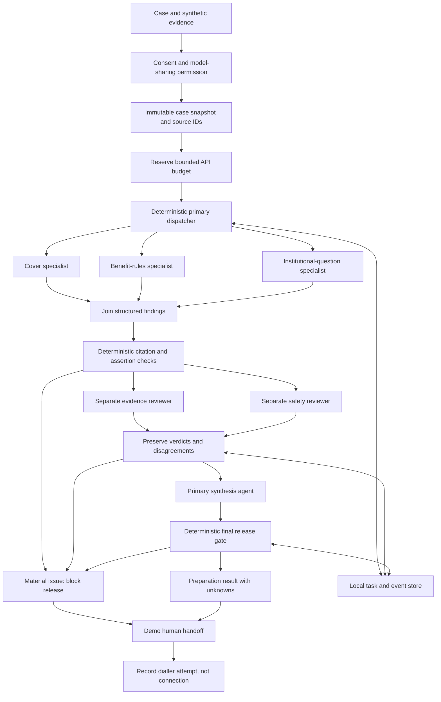

# How Coversaath works

Updated 17 September 2026. The full service below remains a proposal. A local synthetic workflow
scaffold and migration-first SQLite backend structure are implemented; their exact scope is in the final
section and README.md.
Production still needs contracts, consent, security and operational verification.

## Orchestration contract, 15 September 2026

The MVP has two different execution modes. `fixture` runs coded, synthetic outputs to test the
orchestrator without spending money. `live` runs separate model invocations against those same
synthetic sources. A missing key must fail closed. It must never silently become a fixture run.
Live execution is not a live insurance integration. Real policy ingestion remains unbuilt.



### What each role owns

| Role | Receives | Produces | Cannot do |
|---|---|---|---|
| Primary dispatcher | Consented snapshot, trigger, source inventory | Fixed task DAG and bounded dispatch | Let a model change consent or tool permissions |
| Cover worker | Relevant policy excerpts | Existing-cover observations and missing facts | Turn cover limits into payable cash |
| Rules worker | Excerpts and user-stated treatment | Source-linked conditions and applicability questions | Diagnose or select treatment |
| Coordination worker | Unresolved facts and institutional roles | Questions for hospital, HR, TPA or insurer | Send email without recipient/content approval |
| Evidence reviewer | Sources and candidate findings | Citation issues, contradictions and verdict | Treat worker agreement as evidence |
| Safety reviewer | Sources, trigger and candidate findings | Unsafe certainty, missing authority and verdict | Approve claims or borrowing |
| Primary synthesis | Validated findings and separate reviewer reports | Concise preparation answer and open issues | Hide disagreement or override a blocker |
| Deterministic release gate | All task states, citations, review verdicts and permissions | Release or refusal with reasons | Delegate its decision to the LLM |

Specialists are separate bounded LLM invocations in live mode, not independent services or unrestricted
autonomous agents. They have analysis-only authority in this MVP. Retrieval, messaging, payment and
telephony must later be permission-checked executor tools, not arbitrary model HTTP access.

### Findings, flags and blockers

Every finding carries an ID, bounded text, source IDs, a kind and severity. The source inventory retains
the synthetic document, page and version. Valid source IDs are necessary but not sufficient: an agent
can cite a real excerpt and still invent a conclusion. Coverage observations therefore need a strict
source assertion check. Questions and unknowns stay questions and unknowns.

Warnings flag missing information without pretending it is resolved. Material problems block release:
missing permission, failed required tasks, unsupported assertions, fabricated citations, asserted payout
or cashless certainty, and a blocking review. A blocked run can still offer the human number. Neither
Rishav's demo handoff nor a model reviewer has insurer authority or a distribution licence by implication.

### Handoff and action boundary

The user-approved demo is two actions: click Call, then click the returned phone-number link. The first
records an attempt; the second requests the device dialler. The application cannot know that a call
rang, connected or was answered. No provider-mediated redirection, callback or transfer is claimed.
The phone number is configured server-side. The URL contains no patient or policy details.

Sharing case context is a different permission from opening the dialler. Default to no sharing. A
handoff packet, when permitted, must preserve sources, unresolved questions and reviewer disagreements.
Revocation cancels subsequent processing and removes retained local case outputs. Handling copies
already sent to a provider requires a separate retention agreement and deletion process.

### Durable execution and spending

Persist run IDs, immutable snapshots, task states, attempts, public execution events, outputs and usage.
Do not expose private model chain of thought or credentials. On interruption, retain completed work and
mark in-flight work uncertain. Resuming can repeat an API request that was billed before the crash;
never describe this as exactly-once model execution. Reserve budget before parallel dispatch and retry.
Provider usage and local estimates are not a provider billing receipt.

The user has $5 of OpenAI credit and a ₹1,500 build budget. These are ceilings and
preferences, not evidence of costs. Start with synthetic packets, bounded outputs and a small per-run
limit. Gemini is the default provider preference, not a verified reliability winner for this task.
Evaluate citation fidelity, correct refusal, contradictions and cost before increasing spend.

Google's pricing page checked on 15 September lists `gemini-3.8-flash` at $0.75 input and $3.75 output
per million tokens, including thinking tokens, through 31 December 2026. Rates change in January.
Model access still depends on the user's account. Configure the model and rates explicitly and use
synthetic records, especially on free-tier services whose data terms differ.
[Google model pricing](https://ai.google.dev/gemini-api/docs/pricing).

### Integration seams after orchestration

Gnani will handle consented speech intake and approved read-back. Telephony and context transfer remain
separate integrations. Pine Labs remains licensed-partner checkout and payment reconciliation, not
claim funding or insurance issuance. Institutional email will use a permissioned outbox: draft,
approved payload, attempted delivery, response received, reviewed response and unresolved/closed question.
Each question has its own owner; independent questions can progress in parallel, but an unverified reply
cannot unlock a binding coverage conclusion. Delhivery remains out of scope without a physical need.

The CodeRabbit-inspired pattern is evidence packets, specialised parallel analysis, separate verification
and a release gate. This is our insurance design, not a claim to reproduce CodeRabbit's private topology.
[Public CodeRabbit architecture](https://docs.coderabbit.ai/overview/architecture).

## The simple version

Someone arrives with a buying decision. The agent reconstructs what the household already holds, finds
out who operates it, tests whether a backup can use it, then names the real gap. The household may add
voluntary income, loans, commitments and emergency savings to price routes and plan a known cash need.
The agent recommends a route. A licensed human enters for a purchase recommendation, exception or request.
The household approves, buys through a licensed partner, and the issued policy is checked. The same record
then carries renewal, job changes, planned care and claims.

The main object is a **household protection record**, not a chat. It contains people, policies,
employer benefits, permissions, sources, events and the real operator. Time-bound work happens in a
**case** with a reason, questions, owners, deadlines and a completion condition. Chats and calls update it.

The record has six linked parts:

- **Existing-cover map:** policies, employer benefits, members, versions and what is still unknown.
- **Operator graph:** who knows, pays, decides, stores documents and acts, including outside relatives.
- **Emergency handover:** minimum documents, support contacts, unknowns, backup person and first actions.
- **Continuity ledger:** policy versions, disclosures, waiting periods, renewals, claims and job changes.
- **Affordability plan:** voluntary income, fixed commitments, loans, emergency savings, premiums and
  scenario-specific cash needs, each kept separate from insurance cover.
- **Household Health Card:** the concise user view of cover, gaps, costs, roles, emergency route and next action.

An **expense plan** is created only when a real planned-care or claim case exists. It holds relevant
cover, expected cash timing and unresolved shortfall. It is not part of a buying case by default.

The claims-backwards extension adds four case-only objects:

- **Admission event:** patient, clinician-recommended procedure, hospital, estimate, date and urgency.
- **Benefit rule:** a cited policy clause for a procedure, therapy, condition, room type, co-pay,
  deductible, waiting period, exclusion or network condition.
- **Institutional question:** the exact unresolved point, permitted recipient, authority expected to answer,
  due date, response and current status.
- **Admission Readiness Brief:** a versioned summary of benefit rules, unknowns, document checklist,
  deposit scenario and owners. It is preparation, not a claim decision.

Each benefit rule must retain its policy version, source location, extraction status and applicability
status: `potential`, `institution-confirmed`, `not-applicable` or `unresolved`. The system must never
convert `potential` into money available.

Before creating a long-running case, capture `unresolved_question`, `existing_helper`,
`expected_answer_authority`, `service_owned_action` and `completion_or_exit_condition`.
An existing helper completing the job is a valid exit. A permissioned collaboration request is
preferable to duplicate calls. These are proposed fields from the paired-agent review, not shipped code.

```text
Buying trigger and consented documents
                           |
     Consent and permission layer (deterministic, enforced on every read and write)
                           |
     Existing-cover reconstruction from source documents
                           |
     Operator verification and five-minute readiness drill
                           |
     Gap identification plus optional affordability calculations
                           |
       Agent recommendation, human gate only for purchase or exception
                   /                   \
          Household view         Human review desk
                   \                   /
       Commission disclosure, approval, licensed purchase
                           |
 Issuance check, updated handover, renewal and claims-backwards care continuity
```

## Consent and permission: a core layer, not a later hardening step

Consent is the first thing built and the thing every other component calls. A buying case depends on
records that belong to several adults, so permission is the product's load-bearing mechanic. It cannot
be a production extension.

- Every person in the record is an adult subject with their own consent state, not a field on a household.
- Consent is scoped: which records, for which purpose, visible to whom, for how long, revocable at any time.
- A young adult cannot consent for a parent. A spouse cannot consent for a spouse. A translation is not consent.
- Permission checks run in deterministic code on every read, write, share and outbound request. They are
  never a model judgement and never inferred from family relationship.
- Revocation blocks subsequent access immediately and triggers the agreed handling of downstream copies.
- Every access, share and institutional request is recorded with actor, purpose, scope and timestamp.
- A proxy-reported fact stays labelled as proxy-reported until the subject confirms it.

Data protection duties and the correct intermediary structure need qualified legal review before any real
household is onboarded. This pack states the exposure. It does not assert a compliance conclusion.

## Data: what each source can and cannot tell us

| Source | Useful information | Boundary |
|---|---|---|
| Policy schedule, wording, endorsements and customer information sheet | Insured members, dates, conditions and version-specific terms | Marketing summaries cannot override issued documents |
| Manually uploaded employer booklet or authorised benefits reply | Enrolled members and available employer benefits | Payroll data alone does not prove policy terms or remaining cover; no HRMS connection is active |
| Insurer or TPA replies | Case-specific status, authorisations, queries and settlement details | Submission, preauthorisation and final settlement are different states |
| Corporate policy booklet, HR or benefits administrator reply | Employer benefit terms, enrolled members and treatment-specific limits | A verbal HR assurance or generic cover amount does not confirm a claim |
| Household voice, WhatsApp or manual input | Priorities, remembered history, family roles, named relatives and missing records | A named helper is not verified until contacted; proxy answers stay labelled |
| Readiness drill result | Whether a backup person can actually locate cover and the support route | A pass is operational readiness only, never proof of adequate cover |
| Hospital estimate and requested documents | Planned cost and requested deposit | Estimates can change; treatment choice belongs to clinician and patient |
| User-added cards and issuer terms, supplied manually | Potential applicable card benefits | Card ownership does not establish eligibility for a particular benefit |
| User-labelled accessible funds, in a planned-care case only | Cash the household says is available for a particular event | Keep earmarked money and joint-owner restrictions separate |
| User-entered income and fixed commitments | A voluntary affordability view for premiums and a specific cash scenario | Income is not savings, and affordability is not an underwriting result |
| User-entered loans and EMIs | Committed monthly outflows and repayment pressure | Do not use them to recommend borrowing or infer creditworthiness |
| Emergency savings and selected liquid assets | Household-stated reserve for a specific scenario | Keep ownership, earmarks, market risk and liquidity separate |

**Minimum onboarding:** the current buying question, household role, relevant policy documents and
recorded permission to process them. Nothing else is required to reconstruct cover and name a gap.
Affordability inputs appear only after a gap or a planned-care question is known.

**Out of scope from default onboarding:** credit reports, full investment holdings, tax documents and
payroll salary connectors. A household may later add selected facts where a real affordability question
needs them. The agent must explain why each number changes the plan. "Every integration works" is not
"collect everything".

Every extracted fact needs: subject, value, source document and location, document version, effective
date, retrieval time, confidence, reviewer status, permitted viewers and any expiry. Labels:
document-backed, remembered, proxy-reported, unresolved, institution-confirmed. Confidence is not
coverage certainty.

Every relationship also needs: role, person who nominated them, consent state, reachable channel,
information they may see, actions they may take, last verification and backup. Family membership does
not automatically create access or authority.

## Parallel agent jobs

- Intake agent organises questions and gets missing facts without repeatedly asking everyone.
- Document agent extracts facts and links each to the source page.
- Policy agent retrieves the exact applicable wording and identifies conflicts.
- Cover-reconstruction agent assembles the existing-cover map and lists what remains unknown.
- Benefit-rules agent extracts treatment, therapy and condition-specific limits, room rules, co-pay,
  waiting periods, exclusions and deductibles with a source citation.
- Gap agent compares the reconstructed map against the stated need using checked rules.
- Affordability agent separates premiums, income, commitments, loans and stated reserves into a scenario.
- Card agent produces the Household Health Card and marks every number as confirmed, stated or unknown.
- Handover agent tests whether a backup person can retrieve the right record within five minutes.
- Coordination agent drafts requests, tracks deadlines and follows up within permission.
- Admission-brief agent turns a planned procedure into source-linked questions, required documents,
  cash scenarios, institutional owners and deadlines.
- Review agent checks unsupported assertions, contradictions, missing consent and undisclosed commission.

Independent tasks may run in parallel. Dependent steps wait for their inputs. A second model repeating an
answer does not verify it. Policy arithmetic, permission checks, commission disclosure and state
transitions use tested code, not free-form model judgment. High-impact uncertainty goes to a human or the
institution, not a majority vote between agents.

### Implemented specialist split, 17 September 2026

The local synthetic build now has three deterministic specialist modules before the existing review DAG:

1. **Profile intake agent.** Accepts only purpose-, source- and field-scoped consent. The current helper
   can label legacy HRMS, payroll and Form 16 shaped inputs as profile-only evidence, but the active build
   does not collect them or connect to HRMS. Manual input is the only planned intake path for now.
   Optional affordability inputs stay separate and cannot change coverage truth.
2. **Group health cover agent.** Organises evidence into Policy Protection, Policy Constraints,
   Institutional Intelligence and User Relevance. Institutional Intelligence is restricted to cited
   routes and case status. It cannot rate an insurer or predict approval.
3. **Personal health cover agent.** Organises evidence into Protection, Constraints, Economics and
   Suitability. Suitability identifies evidence gaps and questions. It does not make a regulated product
   recommendation or invent dependent-age rules.

Their outputs join in a source-linked household coverage graph. A deterministic decision agent then
classifies routing, immediacy, stated financial exposure, coverage uncertainty, continuity status and
evidence confidence. It emits no numeric risk score and no probability of approval. This corrects the
earlier generic Risk Engine idea, which could falsely imply that a model can predict an insurer decision.
`UNKNOWN` remains different from `false`. The existing evidence, privacy, safety, household and human
gates still control release and action.

This code operates on structured synthetic evidence. It does not parse real policy PDFs, connect to an
HRMS, send institutional questions, call Gnani, open Pine Labs checkout or establish production consent.

## Case states

**Buying case:** trigger received → consent recorded → documents received → existing cover reconstructed
→ operator nominated → operator consent requested → operator verified → backup authorised → handover
drafted → five-minute drill run → gap identified or existing cover sufficient → options reviewed →
affordability plan complete or skipped → agent recommendation → adviser gate where needed → household
choice approved → application submitted →
underwriting pending → offer accepted → payment confirmed where required → policy issued → issued terms
checked → handover updated and re-tested → family guide delivered.

The service must preserve refusal, unreachable relative, no policy found, failed drill, existing cover
sufficient, no-purchase recommendation, deferral, withdrawal, rejection and needs-information as real
terminal or branch states. It cannot mark cover reconstructed because a PDF was uploaded, or a handover
ready because a drill was scheduled.

Actual insurer sequences can differ. Support a payment-before-underwriting path without treating payment
as acceptance. An issued policy that differs from the accepted offer remains an open issue.

**Renewal and job change:** opened → current policy and quote imported → changes compared → material
questions asked → adviser review → renew, switch, retain or defer approved → issued terms checked →
handover updated.

**Planned treatment:** opened → procedure, hospital, estimate and date recorded → exact policy terms and
employer documents checked → benefit-specific limits and unknowns identified → Admission Readiness Brief
issued → permissioned questions sent to hospital desk, HR, TPA or insurer → response recorded →
preauthorisation requested where appropriate → treatment and bill updates → claim submission status,
queries, settlement and shortfall reconciled.

Partial settlement is not full reimbursement. Courier delivery is not document acceptance. A submitted
request is not an approval. A dispute is not closed just because the service sent an email. The service
does not depend on a claims API for this workflow: it stores the household's evidence, prepares questions
and tracks answers through permitted channels until a contracted institutional connector exists.

## Human work, not AI narration

The agent reads, extracts, cites, requests missing documents, follows up, updates the Treasury, builds
the affordability scenario and produces the Household Health Card. The expert gets the source documents,
facts, uncertainty and previous actions only at a purchase recommendation, material ambiguity, exception
or customer request. Where practical, they review evidence before seeing the AI recommendation to reduce
anchoring. They record their conclusion, reasons and disagreements.

A disagreement record identifies the disputed fact, each interpretation, evidence, decision authority,
next question and owner. Only the insurer can settle an insurer decision. A human's confidence cannot
replace written confirmation.

Publish actual staffed hours, callback expectations, backups and escalation paths. Do not promise 24/7
support before staffing it. Human minutes per completed decision are capped and measured. "No separate
fee to the customer" is a funding choice, not zero service cost.

### Commission handling in the system

The service is funded by disclosed distribution commission, so the conflict is built into the software
rather than left to adviser goodwill:

- Each recommendable product carries its commission position, recorded against the recommendation.
- The household sees that disclosure before approving, in the same view as the choice.
- "Retain existing cover" and "do not buy" are first-class recommendation outcomes with the same
  workflow, review and record as a purchase.
- Adviser review outcome, case closure and any performance measure are stored separately from sales
  outcome, so pay cannot be tied to a sale.
- The review agent flags any recommendation lacking disclosure, and any case where readiness help was
  gated on a purchase.
- Aggregate purchase, retain, defer and decline rates are reportable.

These controls reduce the conflict. They do not remove it, and none is tested at volume.

### Autonomy boundary

| AI may do after scoped consent | Explicit human approval is required |
|---|---|
| Read, extract, compare and cite documents | Share medical or financial data with another person |
| Reconstruct the existing-cover map from sources | Confirm or correct medical declarations |
| Ask for missing records and track replies | Buy, renew, replace or cancel a policy |
| Monitor renewal, job-change and institutional deadlines | Pay a premium or accept a settlement |
| Prepare questions, claim packs and a human briefing | Make treatment choices or represent insurer approval |
| Build an Admission Readiness Brief from cited policy terms | File a claim, accept a settlement or promise payment |
| Alert the right authorised person | Contact a relative or parent for the first time |

During a crisis, the customer sees the human and the next action. The agents work backstage. This is
not a human reading AI output aloud. The expert interprets evidence separately and may disagree.

## Five-screen competition demo

1. **The trigger:** a renewal notice or new job arrives, and the user says what they are trying to decide.
2. **What you already have:** existing family and employer cover reconstructed from source documents, with unknowns shown.
3. **Who can actually use it:** the operator named, contacted with consent, verified, and the five-minute drill run with a backup person.
4. **The real gap and cost:** coverage route, premium range and optional income, loan and emergency-cash scenario.
5. **Finish the decision:** agent recommendation, human gate if needed, approval, purchase, issuance check and Household Health Card.

Screen 3 is where the submission differs from a comparison site. It is not a separate product, and the
demo must not stop there. The final card shows cover, gaps, premium cost, affordability context, roles,
emergency route and next event. An optional continuity tab shows renewal and planned care on the same record.

For the planned-care extension, the same record produces an Admission Readiness Brief instead of a
generic "claim score": the procedure-specific caps, corporate-plan unknowns, document list, deposit
scenario and questions owned by the hospital desk, HR, TPA or insurer.

### Illustrative cash example, not policy advice

A hospital estimates ₹5 lakh. A checked scenario identifies up to ₹3 lakh of potentially applicable
cover. A second policy's applicability remains unresolved. Show an indicative ₹2 lakh gap **if** that
₹3 lakh is payable, with the unresolved second policy separately listed. Do not count it as money
available. If nothing is confirmed, the household may need to prepare for a larger amount.

Track the requested deposit separately from expected final out-of-pocket expense. Do not assume a new
top-up covers an already planned procedure, a no-claim benefit is lost after every claim, or two
indemnity policies allow recovery beyond the eligible expense. No recommendation to postpone necessary
care to preserve a bonus.

## Sponsors and rails

| Organisation | Honest role | Boundary |
|---|---|---|
| Gnani, voice rail | Load-bearing consented multilingual intake, read-back and transfer used to reach the parent or outside relative who holds missing policy facts | The parent must see only their authorised record; existing full-context transfer alone is not enough |
| Pine Labs, payments rail | User-approved premium payment through the authorised merchant flow; track failures and reconciliation | Payment success never means policy issuance; no autonomous loans or investment sales |
| Delhivery, logistics rail | Conditional tracking of sealed physical records when required and a suitable service is available | No parcel merely to feature a sponsor; validate service acceptance, pickup and privacy arrangements |
| Zerodha, main partner | Later optional selected-asset context for a specific affordability scenario | Not a default data feed, not a trading rail and not required for buying insurance |

**Specific Gnani capability to test:** permission-preserving handoff across a young adult, parent,
outside relative and expert. Carry verified facts and unresolved questions without exposing private records.
Validate the gap against Gnani's actual product in office hours before claiming it is absent.

Test switching languages, revoked consent, payer-versus-patient roles, uncertain medical recall and a
human correcting an AI extraction. Read-back is necessary but not sufficient verification.

## Hackathon implementation

Use a small web interface, case API, relational database, private document storage, background job queue
and model gateway. Store source citations, consent events and audit records alongside the structured case.
Keep a deterministic rules module and the permission layer separate from prompts.
Choose a stack the team can maintain rather than buying every available platform.

Begin with synthetic people and clearly marked sample policies. Keep HRMS out of the active build. Model
manually uploaded employer documents and later authorised institutional replies behind typed interfaces.
A connector response includes source, timestamp, subject, permission and verification
status. Mark every mocked integration in the UI and presentation. Use a payment sandbox if access is
actually granted. Do not imitate successful live transactions.

Implement one complete buying case end to end: reconstruct cover, verify the operator, run a cold drill,
name the gap, enter voluntary income and loan inputs, generate the Household Health Card, make an agent
recommendation, route a purchase gate where needed, then check issuance and update the handover. A team
member can manually operate the human desk and voice calls. Do not label a scripted demo as an autonomous
live service.

Claude Code, Cursor, Codex and Grok can work on this shared repository; cloud chats need uploads or an
explicit connection. Use one tool for a bounded change and another to review the diff and tests. They do
not share memories automatically. Consumer tool subscriptions do not establish production API access,
included API credits or hosting rights. Verify those separately before deployment.

## Production extensions

1. Prove the manual service helps a household complete a buying decision better than existing support.
2. Define insurance distribution, advice and data-processing responsibilities with qualified partners and
   legal review, including who holds the licence and how commission is disclosed and recorded.
3. Add real connectors under scoped consent and contracts. Reconcile updates rather than silently
   overwriting facts.
4. Harden the consent layer built in phase B: encryption, tenant isolation, deletion, retention and
   revocation procedures at production scale.
5. Run policy-version evaluations, human quality checks and controlled rollout with incident handling.
6. Add insurer-specific workflows, payment reconciliation and durable retries with idempotency.
7. Add versioned rules for portability, waiting-period credit, moratorium, room-rent limits, co-pay,
   deductibles and proportionate deductions. Each result must cite the applicable policy and current rule.
8. Add the Admission Readiness Brief with versioned procedure and therapy limits, employer-plan evidence
   and separate hospital, TPA and insurer question tracks.
9. Add grievance and institutional deadline tracking without implying that the service controls the outcome.
10. Only then consider an employer or benefits-platform channel, and define what the employer may and may
   not see before selling into one.
11. Add consented financial connectors only after manual affordability scenarios show that user-entered
    income, loans and savings are insufficient or too burdensome.

Employers, if used later as a channel, receive agreed service metrics, not employee medical histories by
default. Consider small-group reidentification before sharing aggregate reports. Decide retention and
regulatory duties with current legal advice, not a generic compliance badge.

## Release-blocking tests

| Test | Required behaviour |
|---|---|
| Recommendation attempted before cover reconstructed | Block the recommendation and name the missing documents |
| Wrong member extracted | Stop affected recommendation and request correction |
| Old wording conflicts with endorsement | Surface conflict and apply verified current contract hierarchy |
| Missing history supplied by child | Preserve proxy status; seek appropriate confirmation |
| Adult revokes sharing | Block subsequent access and handle downstream copies under the agreed process |
| Young adult tries to consent for a parent | Refuse and request the parent's own recorded permission |
| Two agents agree on unsupported coverage | Still reject unsupported certainty |
| Duplicate policies or stale claim balance | Do not double-count available money |
| Commission not disclosed at recommendation | Block approval until the disclosure is recorded |
| Existing cover is sufficient | Recommend no purchase and close the case as a success |
| Income and loan inputs are absent | Show coverage result and mark affordability as not calculated |
| Savings are earmarked | Keep them separate from emergency cash and do not count them automatically |
| Several policies exist | Show each policy and order of use separately; do not add them into guaranteed cash |
| Therapy has a lower internal benefit limit | Show the cited cap separately from sum insured and mark its applicability unconfirmed |
| Employer cover has no benefit booklet | Mark employer terms unresolved; draft an authorised question instead of guessing |
| Hospital, TPA and insurer give different answers | Preserve each response, name the authority for the disputed point and keep the brief open |
| Readiness help gated on a purchase | Flag as a policy breach and unblock the help |
| Failed or repeated payment webhook | Idempotent reconciliation, no duplicate charge |
| Payment succeeds but underwriting rejects | Show distinct states and track institution refund process |
| Issued schedule differs from accepted terms | Keep case open and escalate discrepancy |
| Human contradicts AI | Record reasons and route the unresolved decision |
| No expert available | Show actual callback route, not fake live support |
| Emergency | Give immediate support contacts; never gate treatment on optimisation |
| Named relative cannot find policy | Mark delegation unverified; do not present the family as ready |
| Parent refuses young adult access | Respect refusal and offer a minimal parent-controlled handover |
| Five-minute drill fails | Keep readiness incomplete and record the exact failure |

Measure completed buying decisions, no-purchase and retain outcomes, unsupported high-impact claims,
repeat information requests, user comprehension, human minutes, reopen rates and institutional response
times. Monthly active users would reward engagement the product does not need.

## MVP build baseline and update, 15 to 17 September 2026

The user authorised parallel building and MVP structure before live integrations. The supplied email
confirms admission to Round 2 and future sandbox access. It does not establish completion of Round 2,
Round 3 admission, activated credentials or a new track selection. Email instructions do not authorise
registration, outreach or transactions.

### Implemented now

The repository has a local web workspace, modular Node API, deterministic case engine, migration-first
SQLite schema and safety tests. The server entry point is split from request, security and error helpers.
The versioned `/api/v1` routes use the database services as their system of record for households,
consent, cases, transitions, analysis-job metadata and audit history. The existing browser demo still
uses its older memory-only `/api` routes, so visible demo cases do not persist across restart.

The SQLite migration creates relational structures for households, adults, household roles, scoped
consent, cases, document metadata, OCR jobs, source pages, policies, evidence facts, coverage-graph
snapshots, workflow runs and tasks, reviews, approvals, provider outbox work, retention and append-only
audit events. Database startup runs ordered checksum-verified migrations and enables foreign-key checks.
This is a working local database structure. It is not authenticated tenant isolation, production
encryption, private object storage or proof that real health data is safe to load.

Repository and service modules now support households, adults and members; scoped consent grant and
revocation; case transitions with optimistic revision checks; database-backed workflow runs and tasks;
idempotent task enqueue; transactional task claiming; and hash-chained audit events. Revocation cancels
pending provider outbox work tied to that consent and queued workflow work for the household. The task
repository survives process restart, but no continuously running production worker, lease recovery or
exactly-once execution is claimed.

Manual document intake is the only approved intake boundary. The database can store controlled document
metadata, hashes, consent references, OCR job state and source pages, but the HTTP API does not yet accept
or store raw uploads. There is no HRMS connector in the active plan. Employer evidence must come from a
user-supplied document or a later permissioned institutional reply.

Sarvam OCR, Gnani voice, Pine Labs payment and institutional email have separate provider modules. Each
reports configuration state, checks explicit authorisation and fails closed when it is not configured.
The Sarvam module is a typed OCR seam, not proof that a file was uploaded, submitted or recognised.
The Gnani module does not prove a phone call, WhatsApp flow or warm transfer. The Pine Labs module does
not prove merchant access, payment or policy issuance. The email module does not send a message in the
current build.

Primary, worker and review roles remain separate bounded functions with trace events. Fixture mode runs
coded synthetic outputs. Optional model mode applies to synthetic source packets only. No real policy is
interpreted and no provider connectivity has been verified.

An explicit single-adult demo permission gates processing. The primary orchestrator starts cover,
benefit-rule and coordination workers in parallel over one fixture version, joins structured results,
then runs evidence, privacy and safety checks. Failed checks block release. All sample applicability
remains unresolved. Repeating a completed run is idempotent and does not erase tracked replies.

The brief contains synthetic source-page/version references, unknowns, cash scenarios and questions.
Question approval is local simulation, not email delivery. Replies remain unverified evidence, never
instructions or claim approval. Retain, defer and buy simulations share commission disclosure and
household choice records. Buy requires a demo human gate and household approval; payment never issues cover.

Emergency direction is admission-first, with no claimed live staffing. Operator verification, backup
authority and the cold drill remain incomplete. Buying transitions are demonstrations, not eligible
real purchases. A new policy is never assumed to pay an already planned treatment.

Session-owned in-memory demo cases, Host/Origin checks, payload limits and mutation locks remain
implemented for the legacy routes. The SQLite-backed versioned routes enforce their scoped consent on
analysis creation and preserve revocation and audit state across restart. Neither route family has
production per-adult authentication, and the browser UI does not yet use the versioned API. Production
downstream deletion is not implemented.

### Agreed end-to-end workflow

```text
Real decision trigger
  -> named-adult consent
  -> manual document upload
  -> document validation and immutable version
  -> Sarvam OCR job
  -> source-page extraction and human correction where needed
  -> profile, group-cover and personal-cover agents
  -> source-linked Coverage Graph
  -> deterministic classification and policy rules
  -> evidence, privacy and safety review
  -> licensed human or exception gate where required
  -> household approval
  -> permissioned Gnani, email or Pine Labs action
  -> institutional, payment and issuance reconciliation
  -> updated Household Health Card and continuity record
```

Consent must be recorded before document bytes are accepted or sent to Sarvam. A button may begin with
"Add documents", but the transfer must wait for the named adult's current document-processing consent.
Each external action rechecks the subject, purpose, recipient, exact payload, expiry, case revision,
release gate and any required human approval. Provider output returns as untrusted evidence. It does not
change a binding state by itself.

Independent specialist tasks can run in parallel only after cited evidence is ready. Their results join
before the graph is built. Deterministic code owns permissions, state changes, contract hierarchy,
arithmetic, idempotency and release. Model agreement does not confirm coverage.

### State separation

Keep related states separate instead of using one optimistic status string:

| State group | Minimum progression | Boundary |
|---|---|---|
| Case | `created -> collecting -> processing -> human_review or blocked -> ready -> closed` | Optimistic revision checks reject stale changes |
| Document | `quarantined -> active -> deletion_requested -> deleted` | No OCR until consent, validation and safe storage pass |
| OCR | `queued -> submitted -> processing -> succeeded or failed or cancelled` | OCR success does not mean extracted facts are correct |
| Evidence | `unknown`, `known`, `conflict` | Known document claims require a source page; conflict is preserved |
| Workflow | `queued -> running -> completed or blocked or failed or cancelled or revoked` | Retries are bounded and idempotent; interruption may have external cost |
| Review gate | `pending -> passed or blocked or human_review_required` | Evidence, privacy, safety, regulated recommendation and external action remain separate gates |
| Institutional question | draft, approved payload, sent, acknowledged, answered, reviewed, closed | Sent is not answered; acknowledgement is not authority |
| Payment | checkout pending, payment pending, succeeded, failed or unknown | Payment is not underwriting acceptance or issuance |
| Insurance | application, underwriting, offer, acceptance, issuance, issued-terms check | A changed issued schedule keeps the case open |
| Continuity | operator nominated, consented, verified; backup authorised; drill run and passed or failed | Nomination or scheduling does not establish readiness |

Emergency handling is a priority route, not another processing state. The visible instruction is
**Admit first. Optimise later.** It must be available before processing consent. Care cannot wait for
upload, OCR, cover reconstruction, financial input, a model or the five-minute drill. Any later data
processing still needs the normal permission gates.

Recommendation and purchase remain regulated gates. A purchase path requires reconstructed cover,
visible unknowns, commission disclosure, the applicable licensed-human review, and explicit household
approval. Gnani cannot create authority. Pine Labs payment cannot issue insurance. Email cannot turn an
unverified reply into an insurer decision.

### Deterministic insurance-rules responsibility matrix

The `src/modules/insurance-rules/` package owns classification after source-linked extraction. It is a
bounded rules package, not a prediction model. Its compatibility adapter allows the current decision
agent to migrate later without making the rules depend on orchestration, HTTP, persistence or providers.

| Responsibility | Deterministic output | Required boundary |
|---|---|---|
| Contract hierarchy | Controlling source layer and latest version within each document family | Issued evidence outranks summaries; equal controlling disagreements remain conflicts |
| Evidence state | `known`, `unknown` or `conflict` | A missing source id, type, version or page cannot produce a known fact |
| Policy constraints | Room rule, sublimit, co-pay, waiting-period and exclusion observations | Observation is not approval, eligibility or a payable amount |
| Treatment relevance | Potentially relevant, not relevant on cited term, unknown or conflict | Requires the named member and treatment-specific evidence; approval stays null |
| Multiple policies | Separate group and personal contract layers | Limits are not added, double counted or converted into cash |
| Cash planning | Stated upfront estimate, stated available cash and planning gap | Possible final exposure remains separate and unknown without an institutional outcome |
| Continuity | Verified operator, authorised backup and passed drill, each with a citation | Readiness does not establish adequate cover |
| Work routing | Emergency, clarification, human review, purchase review or no action | Routes work only; purchase, payout, underwriting and treatment are never authorised |

Emergency routing always wins and shows **Admit first. Optimise later.** A source-backed no-need record
can route to no action, but this is not an insurance recommendation and does not remove the household's
right to request licensed review.

### CodeRabbit-inspired review architecture

CodeRabbit's [public architecture](https://docs.coderabbit.ai/overview/architecture) describes sandboxed
analysis, deterministic tools, contextual exploration, specialised parallel agents and feedback memory.
Borrow the evidence pipeline and gates, not assumed private prompts, models or deployment topology.

| Review pattern | Coversaath production target |
|---|---|
| Versioned change snapshot | Case revision plus authorised document/version snapshot |
| Deterministic analysis | Permissions, contract hierarchy, arithmetic and state validators |
| Specialist investigation | Bounded extraction, cover, operator, benefit, cash and coordination workers |
| Finding verification | Source/member/version/applicability and contradiction checks |
| Release gate | Block material issues, then institution or licensed human approval where required |
| Feedback memory | Reviewed correction events with source and scope, never silent replacement |

Workers receive question-specific minimum context and cannot contact people or pay. Reviewers return
issues with severity, source, affected fact, owner and needed confirmation, rather than overwriting
worker outputs. The main agent plans and synthesises. Deterministic code owns authority and execution.
High-impact uncertainty remains unresolved, not settled by model agreement. Before every external action,
the executor re-checks actor, current consent, recipient, exact approved payload, expiry and action state.

### AI analysis responsibility matrix

The AI boundary is now a separate `src/modules/ai-analysis/` package. It is a contract and local test
implementation, not a verified live model integration. The coverage runtime can receive AI-capable task
executors through its existing registry injection point. Enabling one requires an explicit request builder
and result adapter for that task. There is no automatic replacement and no fixture-to-live fallback.

| Work | Model role | Code-owned boundary |
|---|---|---|
| Profile extraction | Extract only requested fields from authorised excerpts | Consent, source scope and field allowlist |
| Group-cover extraction | Extract cited wording and unresolved applicability | Contract hierarchy, arithmetic and graph assembly |
| Personal-cover extraction | Extract cited wording, conflicts and missing facts | Suitability rules and recommendation gate |
| Evidence synthesis | Summarise already extracted evidence | Evidence, privacy and safety verdicts |
| Question drafting | Draft a question for a named authority | Approval, recipient selection, sending and reply authority |
| All other stages | No model use | Consent, authorization, classification, state, external actions and release |

Every task has a minimum-context input contract and a strict structured output contract. Source text,
OCR text and upstream agent output are serialized as untrusted evidence, never added to system
instructions. Every output claim or question must cite a supplied source ID. Unknown and conflicting
source states must remain visible. Unsupported promises about coverage, cashless access, reimbursement,
claim approval or insurer payment are rejected rather than rewritten.

The model gateway has explicit `fixture` and `live` modes. Live mode requires an injected model runner,
a cost-reservation ledger and recorded provider, model, model version, prompt version, token usage and
actual cost. Input bytes, output tokens, timeout, retries and per-call reservation are bounded. The SDK
runner uses the installed AI SDK v7 `ToolLoopAgent` structured-output path with no tools and one model
step. No API key, provider model or live execution has been added or verified in this build.

### Offline AI safety evaluation report

The repository now has a separate deterministic evaluation package in `src/evaluation/`. Its versioned
synthetic reference set exercises 23 release-policy cases across nine dimensions. Run it with
`npm run eval:safety`. It makes no network call and its estimated provider cost is ₹0.

| Dimension | Cases | Required score | Current local result |
|---|---:|---:|---:|
| Instruction integrity | 2 | 100% | 100% |
| Evidence and citation fidelity | 3 | 100% | 100% |
| Unknown-state preservation | 1 | 100% | 100% |
| Coverage arithmetic boundaries | 2 | 100% | 100% |
| Insurance and medical safety | 3 | 100% | 100% |
| Commission and factuality | 3 | 100% | 100% |
| Privacy, reviewer isolation and roles | 3 | 100% | 100% |
| Repeatability, size, budget and timeout bounds | 4 | 100% | 100% |
| Emergency care-first language | 2 | 100% | 100% |

The cases cover prompt injection in OCR text, instructions split across documents, missing and incorrect
citations, source-version mismatch, `UNKNOWN` changed to false, group and personal cover double counting,
sum insured treated as payable cash, approval, payout and diagnosis claims, hidden commission, fabricated
insurer facts, invented amounts, privacy over-sharing, reviewer contamination, role-boundary breaches,
inconsistent repeated output, oversized input, budget and timeout bypass, and language that delays emergency
care. Safe control cases confirm that the evaluator can pass bounded output rather than blocking everything.

This is a regression result for deterministic policy checks against authored synthetic examples. It is
not a model benchmark, production accuracy measurement, medical validation, security certification or
evidence that an insurer will agree. It does not test Sarvam OCR quality, a live model, real adversarial
documents, provider availability or false-negative rates outside this small reference set. Those require
separately governed evaluation data and qualified human review before real household records are used.

### Rails and integration plan

[Gnani's linked quickstart](https://docs.gnani.ai/api/introduction/quick-start) documents STT and TTS.
Start with transcription and approved read-back. It does not itself establish telephone calls, WhatsApp,
warm expert transfer or permission-scoped context handoff. Verify these with actual partner access.
Recording consent is separate from document processing; read-back is not consent or identity verification.
The current voice adapter fails closed without contacting Gnani.

[Pine Labs online-payment docs](https://www.pinelabs.com/docs/online-payments) are the integration source
for sandbox hosted checkout/payment links. Confirm the team's provisioned product, merchant eligibility,
UAT base URL, webhook authentication and refund responsibilities before implementing calls. Credentials
stay server-side and card collection stays hosted. Signed events need freshness checks, deduplication
and reconciliation against an approved purchase. Payment, underwriting and issuance remain separate.
Emergency credit and investment liquidation are not added.

Email requires exact recipient/content approval and minimal disclosure. Preserve replies and authority;
acknowledgements do not bind future claims. HRMS is on hold. The user supplies employer documents
manually for now. Delhivery has no justified MVP role.

### Next structure and production gates

#### Repository naming and dependency contract

This repository is a modular monolith. A folder must identify one clear responsibility. New feature
work should be small enough for one owner to carry from its public interface through rules, persistence
and tests. Shared infrastructure must stay narrow. Do not create another general `core`, `utils` or
`helpers` folder when a feature-owned name is available.

- Use lowercase kebab-case for JavaScript files and folders. Use role suffixes such as
  `case-repository.js`, `consent-service.js`, `payment-provider.js` and `case-routes.js`.
- Use `index.js` only as a public export contract. Do not put workflow or business implementation in a
  new barrel file.
- `src/server/` composes the process and routes. HTTP parsing, errors and local request security live in
  `src/shared/http/`. The old `src/server/http/` path is a deprecated compatibility facade.
- `src/backend/` owns persistence and state rules. Backend code cannot depend on server or browser code.
- `src/agents/` owns bounded insurance analysis. Agents cannot read HTTP requests, issue SQL or call a
  provider directly.
- `src/integrations/` owns provider boundaries. Each provider exports through its own `index.js`, and
  the root `src/integrations/index.js` is the only contract used outside that folder.
- `src/shared/` cannot depend on product modules. Product modules may depend on shared contracts.
- The browser cannot import server, backend or provider implementation code. It communicates through
  documented HTTP contracts.
- Temporary compatibility paths must say `deprecated`, preserve the old public contract and contain no
  new implementation. Remove them after callers migrate.
- Put visual artifacts in `docs/assets/`, working evidence in `docs/evidence/`, and communication drafts
  in `docs/comms/`. Keep the active product pack at its stable `research/01-06` and `answers.md` paths.

Run `npm run check:architecture` after structural changes. It checks source naming and the dependency
rules that can be enforced without adding a framework. `npm run check` runs that boundary check, the
full test suite and the frontend build.

1. Wire the local API to the database repositories so SQLite-backed cases, revisions, consent and tasks
   become the local system of record. Keep private document bytes separate from bounded model context.
2. Per-adult authentication and permission checks on every read/write/share, encryption, tenant isolation,
   retention, deletion, export and consent expiry. No real records before these exist.
3. Add the actual raw-upload and private-storage path, then connect it to the existing document metadata,
   Sarvam OCR seam and source-page review. Do not use real records before this is protected and tested.
4. Add a continuously running worker around the database task repository, with bounded retries, leases,
   deadlines, cancellation and revision checks. Repository durability is not end-to-end job execution.
5. Bounded model gateway for extraction/drafts: typed schemas, allowed tools, cost/token/time caps,
   prompt/source versions, source validation and evaluations. Models never grant execution authority.
6. Real operator consent/verification and cold-drill outcomes, then licensed-partner recommendation
   gates and commission controls. Model certainty cannot replace institutional confirmation.
7. Gnani, approved email and Pine Labs sandbox adapters one at a time, with failure-path tests.
   Staffing, distribution/merchant contracts and issuance checks remain separate release gates.

PDFs, emails, transcripts and peer-agent outputs are untrusted evidence, not executable instructions.
See [OWASP prompt-injection guidance](https://cheatsheetseries.owasp.org/cheatsheets/LLM_Prompt_Injection_Prevention_Cheat_Sheet.html)
and [excessive-agency guidance](https://genai.owasp.org/llmrisk/llm062025-excessive-agency/).
Use [NIST's generative AI risk profile](https://www.nist.gov/publications/artificial-intelligence-risk-management-framework-generative-artificial-intelligence)
as a risk-management reference, not a compliance badge. Current insurance obligations, intermediary
structure and data protection require qualified review. This build makes no legal compliance conclusion.
